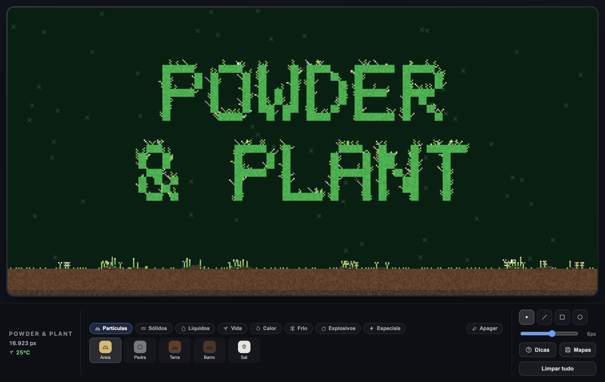

<div align="center">

# 🌱 Powder & Plant

**Um simulador de partículas do tipo falling-sand que roda no navegador.**

[](https://viniciuscastro999.github.io/Powder-Plant/)

[](https://viniciuscastro999.github.io/Powder-Plant/)

<br>


<br>

[](README.md)
[](README.pt-BR.md)
[](README.ja.md)

</div>

---

Pinte areia, água, fogo, lava, ácido, pólvora, plantas e dezenas de outros
materiais numa grade e veja tudo interagir. Líquidos buscam o próprio nível, pós
formam pilhas, o fogo se espalha, explosivos detonam em cadeia, sementes germinam
e uma **temperatura ambiente** global muda conforme o que você coloca no cenário
— comandando combustão espontânea, congelamento, fervura e o crescimento das
plantas.

> A interface está disponível em inglês, português e japonês (seletor no canto inferior esquerdo).

## Recursos

- **~25 materiais** em 8 categorias temáticas, cada um com física própria.
- **Simulação falling-sand** feita do zero — um autômato celular com movimento
  por densidade, propagação de fogo e ácido, e otimização de dormir/acordar.
- **Eletricidade** que percorre condutores em forma de pulsos.
- **Explosões** com ondas de choque, estilhaços e reações em cadeia (Pólvora, C4, gás).
- **Jogo da Vida de Conway** como um material próprio ("Vida").
- **Temperatura global** com 8 faixas — aqueça a grade até a faixa *Próspero* e
  as plantas florescem.
- **Salvar / carregar / exportar / importar** cenários como arquivos `.pnp.json`
  (via `localStorage`).

## Stack

| | |
|---|---|
| **UI** | [Svelte 5](https://svelte.dev/) (runes) + TypeScript |
| **Renderização** | [Pixi.js 8](https://pixijs.com/) desenhando a grade de células |
| **Ferramentas** | [Vite](https://vite.dev/) como bundler e dev server |

Sem dependências de runtime além do Pixi — a simulação é toda código próprio.

## Como rodar

Requer Node.js (recomendado 20+).

```bash
npm install
npm run dev       # dev server com HMR em http://localhost:5173
```

Outros scripts:

```bash
npm run build     # build de produção em dist/
npm run preview   # serve o build de produção localmente
npm run check     # type-check do Svelte + TypeScript
```

## Como jogar

- **Escolha um material** na barra inferior (organizada por categorias).
- **Desenhe na tela** com o mouse ou toque. As formas de pincel são Ponto, Linha,
  Área (quadrado) e Área (círculo), com tamanho ajustável.
- **Borracha** apaga células; **Limpar tudo** zera a grade inteira.
- **Mapas** abre a janela de salvar/carregar: guarde o cenário atual com um nome
  (fica salvo no navegador), recarregue mapas salvos, exporte qualquer um como
  arquivo `.pnp.json` e importe arquivos de volta para compartilhar cenários
  entre navegadores.
- O painel mostra a contagem de células ativas e a **temperatura ambiente**, que
  sobe com Fogo/Lava/Calor e desce com Gelo/Frio, afetando combustão espontânea,
  congelamento, fervura e o crescimento das plantas.
- O botão **Dicas** abre uma janela com a descrição e as interações de cada material.
- O **seletor de idioma** (canto inferior esquerdo, ao lado da temperatura) troca a
  interface entre inglês, português e japonês — a escolha fica salva no navegador e,
  na primeira visita, usa o idioma do navegador.

## Materiais

| Categoria | Materiais |
|---|---|
| Partículas | Areia · Pedra · Terra · Barro · Sal |
| Sólidos | Madeira · Metal · Vidro |
| Líquidos | Água · Óleo · Ácido |
| Vida | Planta · Semente · Vida |
| Calor | Fogo · Lava · Calor |
| Frio | Gelo · Frio |
| Explosivos | Pólvora · C4 · Gás |
| Especiais | Eletricidade · Clone |

Alguns materiais só aparecem como reação: **Broto** e **Flor** (de sementes que
germinam), **Vapor** (água fervida) e **Vapor de Ácido** (ácido fervido).

## Estrutura do projeto

```
src/
  main.ts              ponto de entrada, monta o App
  App.svelte           layout: canvas + painel inferior + modais
  components/
    Canvas.svelte      cria a grade, roda o loop de simulação, trata o pincel
    BottomPanel.svelte seletor de material, pincel, stats, troca de idioma
    HintsModal.svelte  janela de ajuda com descrições dos materiais
    MapsModal.svelte   janela de salvar / carregar / exportar / importar mapas
    Icon.svelte        ícones SVG
  render/
    PixiStage.ts       desenha a grade (e overlays de faíscas/explosão) no Pixi
  sim/
    grid.ts            o coração: autômato celular, física, reações, temperatura
    materials.ts       definição de cada material e agrupamento da paleta
    temperature.ts     faixas de temperatura compartilhadas entre sim e UI
    storage.ts         serialização (RLE) e persistência de mapas no localStorage
    types.ts           MaterialId, categorias, buffers da simulação
  i18n/                traduções da interface (inglês / português / japonês)
    locale.svelte.ts   o idioma ativo, salvo no localStorage
    ui.ts              textos fixos da interface
    materials.ts       nomes dos materiais + rótulos das categorias por idioma
    materialInfo.ts    descrições e interações das dicas por idioma
```

## Como a simulação funciona

O núcleo é [src/sim/grid.ts](src/sim/grid.ts): a grade guarda `material` e `meta`
(um byte por célula) em `Uint8Array` planos, e `step()` percorre a grade de baixo
para cima a cada frame aplicando movimento (pós, líquidos, gases), fogo, ácido,
eletricidade (pulsos), explosões (ondas de choque), o Jogo da Vida de Conway (o
material "Vida") e os efeitos de temperatura ambiente.
